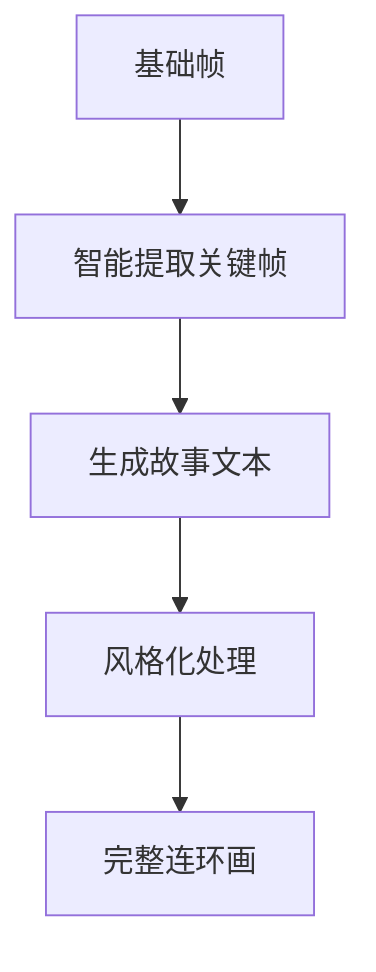

# 🎬 帧织者API文档

## 🎯 核心功能概览

帧织者系统是一个视频转连环画的智能处理平台，提供完整的**视频→基础帧→关键帧→故事→连环画**的处理流程。

### 🚀 三大核心API（重点推荐）

| 序号 | API名称 | 接口地址 | 功能描述 | 推荐指数 |
|------|---------|----------|----------|----------|
| 1️⃣ | **视频上传接口** | `/api/upload/videos` | 上传视频文件，获取任务ID | ⭐⭐⭐⭐⭐ |
| 2️⃣ | **基础帧提取接口** | `/api/extract/base-frames` | 从视频中按时间间隔提取基础帧 | ⭐⭐⭐⭐⭐ |
| 3️⃣ | **完整连环画生成API** | `/api/process/complete-comic` | 一键生成完整连环画（关键帧+故事+风格化） | ⭐⭐⭐⭐⭐ |

### 💡 典型使用流程


## 🔧 基础信息

- **服务地址**: `http://服务器地址:5001`
- **响应格式**: JSON
- **支持格式**: mp4, mov, avi, mkv, wmv, flv, 3gp
- **文件限制**: 最大800MB
- **状态码**:
  - `200` 成功
  - `400` 参数错误
  - `404` 资源不存在
  - `413` 文件过大
  - `500` 服务器错误

## 1️⃣ 核心API：视频上传接口

### 接口信息
- **路径**: `/api/upload/videos`
- **方法**: `POST`
- **格式**: `multipart/form-data`
- **作用**: 上传视频文件，开始处理流程

### 请求参数

| 参数名 | 类型 | 必填 | 说明 |
|--------|------|------|------|
| `device_id` | string | ✅ | 设备唯一标识 |
| `videos` | file[] | ✅ | 视频文件（支持多文件） |

### 请求示例

```bash
curl -X POST "http://localhost:5001/api/upload/videos" \
  -F "device_id=web_client_001" \
  -F "videos=@测试视频.mp4"
```

### 响应示例

```json
{
  "success": true,
  "message": "视频上传成功",
  "task_id": "550e8400-e29b-41d4-a716-446655440000",
  "device_id": "web_client_001",
  "uploaded_files": 1,
  "invalid_files": null
}
```

### 🎯 关键信息
- **📝 记住**: 返回的`task_id`是后续所有API调用的核心参数
- **⚠️ 注意**: 文件必须小于800MB
- **💡 提示**: 支持同时上传多个视频文件

---

## 2️⃣ 核心API：基础帧提取接口

### 接口信息
- **路径**: `/api/extract/base-frames`
- **方法**: `POST`
- **格式**: `application/x-www-form-urlencoded`
- **作用**: 从视频中按时间间隔提取基础帧图像

### 请求参数

| 参数名 | 类型 | 必填 | 默认值 | 说明 |
|--------|------|------|--------|------|
| `task_id` | string | ✅ | - | 视频上传后获得的任务ID |
| `interval` | float | ❌ | 1.0 | 抽帧时间间隔（秒） |

### 请求示例

```bash
curl -X POST "http://localhost:5001/api/extract/base-frames" \
  -d "task_id=550e8400-e29b-41d4-a716-446655440000" \
  -d "interval=1.0"
```

### 响应示例

```json
{
  "success": true,
  "message": "基础帧提取成功",
  "task_id": "550e8400-e29b-41d4-a716-446655440000",
  "results": [
    {
      "video_name": "测试视频.mp4",
      "base_frames_count": 48,
      "base_frames_paths": [
        "frames/test_task_123/base_frame_0000.jpg",
        "frames/test_task_123/base_frame_0001.jpg",
        "..."
      ],
      "output_dir": "frames/test_task_123"
    }
  ]
}
```

### 🎯 关键信息
- **📊 数量**: 通常会生成几十张基础帧
- **🕒 间隔**: 建议间隔0.5-2.0秒，太小会产生过多帧
- **📁 存储**: 基础帧保存在`frames/{task_id}/`目录下

---

## 3️⃣ 核心API：完整连环画生成接口

### 接口信息
- **路径**: `/api/process/complete-comic`
- **方法**: `POST`
- **格式**: `application/x-www-form-urlencoded`
- **作用**: 🌟 一键完成关键帧提取、故事生成、风格化处理的完整流程

### 处理流程



### 请求参数

| 参数名 | 类型 | 必填 | 默认值 | 说明 |
|--------|------|------|--------|------|
| `task_id` | string | ✅ | - | 任务ID |
| `target_frames` | int | ❌ | 8 | 目标关键帧数量 |
| `frame_interval` | float | ❌ | 1.0 | 基础帧提取间隔 |
| `significance_weight` | float | ❌ | 0.6 | 重要性权重(0-1) |
| `quality_weight` | float | ❌ | 0.4 | 质量权重(0-1) |
| `style_prompt` | string | ❌ | 默认水墨画 | 风格化提示词 |
| `image_size` | string | ❌ | 1920x1024 | 输出图像尺寸 |
| `story_style` | string | ❌ | 通用 | 故事文体风格 |
| `max_concurrent` | int | ❌ | 50 | 最大并发数 |

### 请求示例

```bash
curl -X POST "http://localhost:5001/api/process/complete-comic" \
  -d "task_id=550e8400-e29b-41d4-a716-446655440000" \
  -d "target_frames=8" \
  -d "style_prompt=手绘漫画风格，温暖色调" \
  -d "story_style=童话风格"
```

### 响应示例（启动）

```json
{
  "success": true,
  "message": "完整连环画生成已启动",
  "task_id": "550e8400-e29b-41d4-a716-446655440000",
  "status": "complete_comic_processing",
  "progress": 0,
  "stage": "initializing"
}
```

### 🎯 关键信息
- **⏱️ 时间**: 整个处理需要2-5分钟，请耐心等待
- **📈 进度**: 可通过任务状态接口查看实时进度
- **🎨 风格**: 支持自定义风格提示词
- **📚 故事**: 支持多种文体风格（古典、现代、童话等）

## 📊 任务状态查询接口

### 接口信息
- **路径**: `/api/task/status/<task_id>`
- **方法**: `GET`
- **作用**: 查询任务处理进度和状态

### 请求示例

```bash
curl -X GET "http://localhost:5001/api/task/status/550e8400-e29b-41d4-a716-446655440000"
```

### 响应示例

```json
{
  "success": true,
  "task_id": "550e8400-e29b-41d4-a716-446655440000",
  "status": "complete_comic_processing",
  "message": "正在生成故事... (1/1)",
  "progress": 45,
  "stage": "generating_story",
  "device_id": "web_client_001",
  "created_at": "2023-10-15T14:30:15.123456"
}
```

### 任务状态说明

| 状态值 | 阶段 | 进度 | 说明 |
|--------|------|------|------|
| `uploaded` | 上传完成 | 0% | 视频已上传，等待处理 |
| `extracting_base_frames` | 基础帧提取 | 10-20% | 正在提取基础帧 |
| `base_frames_extracted` | 基础帧完成 | 20% | 基础帧提取完成 |
| `complete_comic_processing` | 连环画生成中 | 20-90% | 正在生成完整连环画 |
| `extracting_keyframes` | 关键帧提取 | 20-40% | 正在智能提取关键帧 |
| `generating_story` | 故事生成 | 40-70% | 正在生成故事文本 |
| `stylizing_frames` | 风格化处理 | 70-90% | 正在进行风格化处理 |
| `complete_comic_completed` | 完成 | 100% | 连环画生成完成 |
| `error` | 错误 | - | 处理出错 |

## 📖 获取连环画结果接口

### 接口信息
- **路径**: `/api/comic/result/<task_id>`
- **方法**: `GET`
- **作用**: 获取完整连环画生成结果

### 请求示例

```bash
curl -X GET "http://localhost:5001/api/comic/result/550e8400-e29b-41d4-a716-446655440000"
```

### 响应示例（完成）

```json
{
  "success": true,
  "message": "连环画生成完成",
  "task_id": "550e8400-e29b-41d4-a716-446655440000",
  "results": {
    "successful_comics": [
      {
        "video_name": "测试视频.mp4",
        "success": true,
        "comic_data": {
          "story_info": {
            "overall_theme": "一段关于勇气与成长的冒险之旅",
            "title": "勇气与成长",
            "summary": "年轻探险者的心灵成长历程",
            "total_pages": 8,
            "video_name": "测试视频.mp4",
            "creation_time": "2024-01-15 14:30:00"
          },
          "pages": [
            {
              "page_index": 0,
              "story_text": "阳光透过树叶，洒在年轻探险者的脸上，新的冒险即将开始...",
              "original_frame_path": "frames/task_123/unified_key_00.jpg",
              "styled_frame_path": "frames/task_123/styled/styled_unified_key_00.jpg",
              "styled_filename": "styled_unified_key_00.jpg",
              "frame_index": 0,
              "style_applied": true
            }
          ],
          "interactive_questions": [
            {
              "question_id": 1,
              "question": "你觉得主人公现在的心情如何？",
              "options": ["兴奋期待", "紧张不安", "充满好奇", "有些害怕"],
              "scene_description": "主人公站在冒险的起点",
              "question_type": "情感理解"
            }
          ]
        }
      }
    ],
    "total_processed": 1,
    "success_count": 1,
    "failure_count": 0
  }
}
```

## 🎨 其他辅助接口

### 关键帧提取接口
- **路径**: `/api/extract/key-frames`
- **作用**: 单独提取关键帧（不包含故事生成）

### 故事生成接口
- **路径**: `/api/generate/story`
- **作用**: 为关键帧生成故事文本

### 风格化处理接口
- **路径**: `/api/process/style-transform`
- **作用**: 对关键帧进行风格化处理

### 文件获取接口
- **路径**: `/api/frames/<task_id>/<filename>`
- **作用**: 获取指定的帧图像文件

### 设备任务历史
- **路径**: `/api/device/<device_id>/tasks`
- **作用**: 查看设备的所有任务记录

## 🚨 错误处理

### 常见错误类型

| 错误码 | 错误类型 | 解决方案 |
|--------|----------|----------|
| 400 | 参数错误 | 检查必填参数是否完整 |
| 404 | 任务不存在 | 确认task_id是否正确 |
| 413 | 文件过大 | 压缩视频或分段上传 |
| 500 | 服务器错误 | 重试或联系技术支持 |

### 错误响应示例

```json
{
  "success": false,
  "message": "文件过大，请选择小于800MB的视频文件"
}
```
