# 🎬 帧织者API文档

## 🎯 核心功能概览

帧织者系统是一个视频转连环画的智能处理平台，提供完整的**视频→基础帧→关键帧→故事→连环画**的处理流程。

### 🚀 三大核心API（重点推荐）

| 序号 | API名称 | 接口地址 | 功能描述 | 推荐指数 |
|------|---------|----------|----------|----------|
| 1️⃣ | **视频上传接口** | `/api/upload/videos` | 上传视频文件，获取任务ID | ⭐⭐⭐⭐⭐ |
| 2️⃣ | **基础帧提取接口** | `/api/extract/base-frames` | 从视频中按时间间隔提取基础帧 | ⭐⭐⭐⭐⭐ |
| 3️⃣ | **完整连环画生成API** | `/api/process/complete-comic` | 一键生成完整连环画（关键帧+故事+风格化） | ⭐⭐⭐⭐⭐ |

### 💡 典型使用流程


---

## 🔧 基础信息

- **服务地址**: `http://服务器地址:5001`
- **响应格式**: JSON
- **支持格式**: mp4, mov, avi, mkv, wmv, flv, 3gp
- **文件限制**: 最大800MB
- **状态码**:
  - `200` 成功
  - `400` 参数错误
  - `404` 资源不存在
  - `413` 文件过大
  - `500` 服务器错误

---

## 1️⃣ 核心API：视频上传接口

### 接口信息
- **路径**: `/api/upload/videos`
- **方法**: `POST`
- **格式**: `multipart/form-data`
- **作用**: 上传视频文件，开始处理流程

### 请求参数

| 参数名 | 类型 | 必填 | 说明 |
|--------|------|------|------|
| `device_id` | string | ✅ | 设备唯一标识 |
| `videos` | file[] | ✅ | 视频文件（支持多文件） |

### 请求示例

```bash
curl -X POST "http://localhost:5001/api/upload/videos" \
  -F "device_id=web_client_001" \
  -F "videos=@测试视频.mp4"
```

### 响应示例

```json
{
  "success": true,
  "message": "视频上传成功",
  "task_id": "550e8400-e29b-41d4-a716-446655440000",
  "device_id": "web_client_001",
  "uploaded_files": 1,
  "invalid_files": null
}
```

### 🎯 关键信息
- **📝 记住**: 返回的`task_id`是后续所有API调用的核心参数
- **⚠️ 注意**: 文件必须小于800MB
- **💡 提示**: 支持同时上传多个视频文件

---

## 2️⃣ 核心API：基础帧提取接口

### 接口信息
- **路径**: `/api/extract/base-frames`
- **方法**: `POST`
- **格式**: `application/x-www-form-urlencoded`
- **作用**: 从视频中按时间间隔提取基础帧图像

### 请求参数

| 参数名 | 类型 | 必填 | 默认值 | 说明 |
|--------|------|------|--------|------|
| `task_id` | string | ✅ | - | 视频上传后获得的任务ID |
| `interval` | float | ❌ | 1.0 | 抽帧时间间隔（秒） |

### 请求示例

```bash
curl -X POST "http://localhost:5001/api/extract/base-frames" \
  -d "task_id=550e8400-e29b-41d4-a716-446655440000" \
  -d "interval=1.0"
```

### 响应示例

```json
{
  "success": true,
  "message": "基础帧提取成功",
  "task_id": "550e8400-e29b-41d4-a716-446655440000",
  "results": [
    {
      "video_name": "测试视频.mp4",
      "base_frames_count": 48,
      "base_frames_paths": [
        "frames/test_task_123/base_frame_0000.jpg",
        "frames/test_task_123/base_frame_0001.jpg",
        "..."
      ],
      "output_dir": "frames/test_task_123"
    }
  ]
}
```

### 🎯 关键信息
- **📊 数量**: 通常会生成几十张基础帧
- **🕒 间隔**: 建议间隔0.5-2.0秒，太小会产生过多帧
- **📁 存储**: 基础帧保存在`frames/{task_id}/`目录下

---

## 3️⃣ 核心API：完整连环画生成接口

### 接口信息
- **路径**: `/api/process/complete-comic`
- **方法**: `POST`
- **格式**: `application/x-www-form-urlencoded`
- **作用**: 🌟 一键完成关键帧提取、故事生成、风格化处理的完整流程

### 处理流程

```mermaid
graph TD
    A[基础帧] --> B[智能提取关键帧]
    B --> C[生成故事文本]
    C --> D[风格化处理]
    D --> E[完整连环画]
```



### 请求参数

| 参数名 | 类型 | 必填 | 默认值 | 说明 |
|--------|------|------|--------|------|
| `task_id` | string | ✅ | - | 任务ID |
| `target_frames` | int | ❌ | 8 | 目标关键帧数量 |
| `frame_interval` | float | ❌ | 1.0 | 基础帧提取间隔 |
| `significance_weight` | float | ❌ | 0.6 | 重要性权重(0-1) |
| `quality_weight` | float | ❌ | 0.4 | 质量权重(0-1) |
| `style_prompt` | string | ❌ | 默认水墨画 | 风格化提示词 |
| `image_size` | string | ❌ | 1920x1024 | 输出图像尺寸 |
| `story_style` | string | ❌ | 通用 | 故事文体风格 |
| `max_concurrent` | int | ❌ | 50 | 最大并发数 |

### 请求示例

```bash
curl -X POST "http://localhost:5001/api/process/complete-comic" \
  -d "task_id=550e8400-e29b-41d4-a716-446655440000" \
  -d "target_frames=8" \
  -d "style_prompt=手绘漫画风格，温暖色调" \
  -d "story_style=童话风格"
```

### 响应示例（启动）

```json
{
  "success": true,
  "message": "完整连环画生成已启动",
  "task_id": "550e8400-e29b-41d4-a716-446655440000",
  "status": "complete_comic_processing",
  "progress": 0,
  "stage": "initializing"
}
```

### 🎯 关键信息
- **⏱️ 时间**: 整个处理需要2-5分钟，请耐心等待
- **📈 进度**: 可通过任务状态接口查看实时进度
- **🎨 风格**: 支持自定义风格提示词
- **📚 故事**: 支持多种文体风格（古典、现代、童话等）

---

## 📊 任务状态查询接口

### 接口信息
- **路径**: `/api/task/status/<task_id>`
- **方法**: `GET`
- **作用**: 查询任务处理进度和状态

### 请求示例

```bash
curl -X GET "http://localhost:5001/api/task/status/550e8400-e29b-41d4-a716-446655440000"
```

### 响应示例

```json
{
  "success": true,
  "task_id": "550e8400-e29b-41d4-a716-446655440000",
  "status": "complete_comic_processing",
  "message": "正在生成故事... (1/1)",
  "progress": 45,
  "stage": "generating_story",
  "device_id": "web_client_001",
  "created_at": "2023-10-15T14:30:15.123456"
}
```

### 任务状态说明

| 状态值 | 阶段 | 进度 | 说明 |
|--------|------|------|------|
| `uploaded` | 上传完成 | 0% | 视频已上传，等待处理 |
| `extracting_base_frames` | 基础帧提取 | 10-20% | 正在提取基础帧 |
| `base_frames_extracted` | 基础帧完成 | 20% | 基础帧提取完成 |
| `complete_comic_processing` | 连环画生成中 | 20-90% | 正在生成完整连环画 |
| `extracting_keyframes` | 关键帧提取 | 20-40% | 正在智能提取关键帧 |
| `generating_story` | 故事生成 | 40-70% | 正在生成故事文本 |
| `stylizing_frames` | 风格化处理 | 70-90% | 正在进行风格化处理 |
| `complete_comic_completed` | 完成 | 100% | 连环画生成完成 |
| `error` | 错误 | - | 处理出错 |

---

## 📖 获取连环画结果接口

### 接口信息
- **路径**: `/api/comic/result/<task_id>`
- **方法**: `GET`
- **作用**: 获取完整连环画生成结果

### 请求示例

```bash
curl -X GET "http://localhost:5001/api/comic/result/550e8400-e29b-41d4-a716-446655440000"
```

### 响应示例（完成）

```json
{
  "success": true,
  "message": "连环画生成完成",
  "task_id": "550e8400-e29b-41d4-a716-446655440000",
  "results": {
    "successful_comics": [
      {
        "video_name": "测试视频.mp4",
        "success": true,
        "comic_data": {
          "story_info": {
            "overall_theme": "一段关于勇气与成长的冒险之旅",
            "title": "勇气与成长",
            "summary": "年轻探险者的心灵成长历程",
            "total_pages": 8,
            "video_name": "测试视频.mp4",
            "creation_time": "2024-01-15 14:30:00"
          },
          "pages": [
            {
              "page_index": 0,
              "story_text": "阳光透过树叶，洒在年轻探险者的脸上，新的冒险即将开始...",
              "original_frame_path": "frames/task_123/unified_key_00.jpg",
              "styled_frame_path": "frames/task_123/styled/styled_unified_key_00.jpg",
              "styled_filename": "styled_unified_key_00.jpg",
              "frame_index": 0,
              "style_applied": true
            }
          ],
          "interactive_questions": [
            {
              "question_id": 1,
              "question": "你觉得主人公现在的心情如何？",
              "options": ["兴奋期待", "紧张不安", "充满好奇", "有些害怕"],
              "scene_description": "主人公站在冒险的起点",
              "question_type": "情感理解"
            }
          ]
        }
      }
    ],
    "total_processed": 1,
    "success_count": 1,
    "failure_count": 0
  }
}
```

---

## 🎨 其他辅助接口

### 关键帧提取接口
- **路径**: `/api/extract/key-frames`
- **作用**: 单独提取关键帧（不包含故事生成）

### 故事生成接口
- **路径**: `/api/generate/story`
- **作用**: 为关键帧生成故事文本

### 风格化处理接口
- **路径**: `/api/process/style-transform`
- **作用**: 对关键帧进行风格化处理

### 文件获取接口
- **路径**: `/api/frames/<task_id>/<filename>`
- **作用**: 获取指定的帧图像文件

### 设备任务历史
- **路径**: `/api/device/<device_id>/tasks`
- **作用**: 查看设备的所有任务记录

---

## 💻 前端集成示例

### JavaScript示例

```javascript
class ComicGenerator {
  constructor(baseUrl = 'http://localhost:5001') {
    this.baseUrl = baseUrl;
  }

  // 1. 上传视频
  async uploadVideo(videoFile, deviceId = 'web_client_001') {
    const formData = new FormData();
    formData.append('device_id', deviceId);
    formData.append('videos', videoFile);

    const response = await fetch(`${this.baseUrl}/api/upload/videos`, {
      method: 'POST',
      body: formData
    });

    return await response.json();
  }

  // 2. 提取基础帧
  async extractBaseFrames(taskId, interval = 1.0) {
    const formData = new FormData();
    formData.append('task_id', taskId);
    formData.append('interval', interval);

    const response = await fetch(`${this.baseUrl}/api/extract/base-frames`, {
      method: 'POST',
      body: formData
    });

    return await response.json();
  }

  // 3. 生成完整连环画
  async generateCompleteComic(taskId, options = {}) {
    const formData = new FormData();
    formData.append('task_id', taskId);
    formData.append('target_frames', options.targetFrames || 8);
    formData.append('style_prompt', options.stylePrompt || '');
    formData.append('story_style', options.storyStyle || '');

    const response = await fetch(`${this.baseUrl}/api/process/complete-comic`, {
      method: 'POST',
      body: formData
    });

    return await response.json();
  }

  // 4. 监控进度
  async pollProgress(taskId, onProgress) {
    while (true) {
      const response = await fetch(`${this.baseUrl}/api/task/status/${taskId}`);
      const status = await response.json();

      // 回调更新进度
      if (onProgress) {
        onProgress(status.progress, status.stage, status.message);
      }

      // 检查完成状态
      if (status.status === 'complete_comic_completed') {
        const resultResponse = await fetch(`${this.baseUrl}/api/comic/result/${taskId}`);
        return await resultResponse.json();
      }

      if (status.status === 'error' || status.status === 'complete_comic_failed') {
        throw new Error(status.message || '生成失败');
      }

      // 等待2秒后再次查询
      await new Promise(resolve => setTimeout(resolve, 2000));
    }
  }

  // 完整流程
  async createComic(videoFile, options = {}) {
    try {
      console.log('🎬 开始上传视频...');
      const uploadResult = await this.uploadVideo(videoFile);
      const taskId = uploadResult.task_id;

      console.log('📸 开始提取基础帧...');
      await this.extractBaseFrames(taskId, options.interval);

      console.log('🎨 开始生成连环画...');
      await this.generateCompleteComic(taskId, options);

      console.log('⏳ 等待处理完成...');
      const result = await this.pollProgress(taskId, (progress, stage, message) => {
        console.log(`进度: ${progress}% - ${stage} - ${message}`);
      });

      console.log('✅ 连环画生成完成！');
      return result;

    } catch (error) {
      console.error('❌ 生成失败:', error);
      throw error;
    }
  }
}

// 使用示例
const generator = new ComicGenerator();

// 获取视频文件（从文件选择器）
const fileInput = document.getElementById('videoFile');
const videoFile = fileInput.files[0];

// 生成连环画
generator.createComic(videoFile, {
  targetFrames: 10,
  stylePrompt: '手绘漫画风格，温暖明亮的色调',
  storyStyle: '童话风格',
  interval: 0.8
}).then(result => {
  console.log('连环画数据:', result);
  // 在这里处理和显示连环画结果
  displayComic(result.results.successful_comics[0].comic_data);
}).catch(error => {
  console.error('生成失败:', error);
  alert('连环画生成失败，请重试');
});

function displayComic(comicData) {
  const { story_info, pages, interactive_questions } = comicData;
  
  console.log('故事主题:', story_info.overall_theme);
  console.log('总页数:', story_info.total_pages);
  
  pages.forEach((page, index) => {
    console.log(`第${index + 1}页:`, page.story_text);
    console.log('风格化图片:', page.styled_frame_path);
  });
  
  console.log('互动问题:', interactive_questions);
}
```

---

## 🚨 错误处理

### 常见错误类型

| 错误码 | 错误类型 | 解决方案 |
|--------|----------|----------|
| 400 | 参数错误 | 检查必填参数是否完整 |
| 404 | 任务不存在 | 确认task_id是否正确 |
| 413 | 文件过大 | 压缩视频或分段上传 |
| 500 | 服务器错误 | 重试或联系技术支持 |

### 错误响应示例

```json
{
  "success": false,
  "message": "文件过大，请选择小于800MB的视频文件"
}
```

---

## 📝 重要提示

### ✅ 最佳实践

1. **文件大小**: 建议视频文件小于500MB，处理速度更快
2. **视频时长**: 建议1-10分钟的视频，效果最佳
3. **网络稳定**: 上传和处理过程需要稳定网络连接
4. **耐心等待**: 完整连环画生成需要2-5分钟，请勿重复提交

### ⚠️ 注意事项

1. **任务ID**: 每次上传后记住task_id，用于后续查询
2. **并发限制**: 同一设备建议最多同时处理3个任务
3. **文件格式**: 确保视频格式为支持的类型
4. **存储清理**: 系统会定期清理过期文件

### 🎯 性能优化建议

1. **基础帧间隔**: 对于动作较少的视频，可设置较大间隔（1.5-2.0秒）
2. **关键帧数量**: 建议6-12帧，太少缺乏细节，太多处理时间长
3. **风格化**: 复杂的风格提示词会增加处理时间
4. **并发处理**: 可同时上传多个视频但建议控制在合理范围内

---

*📚 文档版本: v2.0 | 最后更新: 2024年1月*

